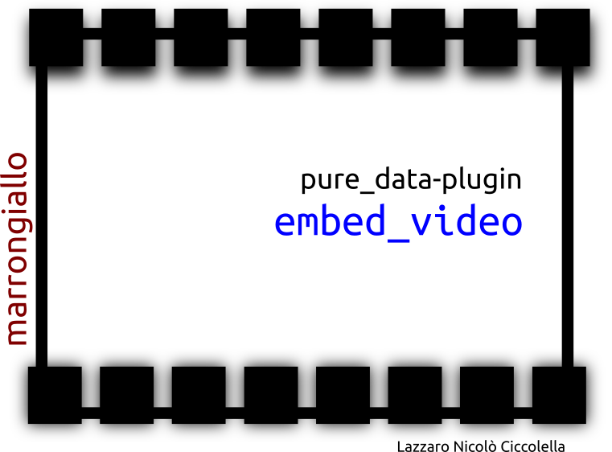

embed_video
===========
puredata plugin
---------------

Embed a video player in a pd PatchWindows. 

Require MPlayer
----------------

MPlayer must be installed in your system.
> mplayer is an open source software available for all major systems, to install it on your computer follow the instructions given on the manufacturer's website [http://www.mplayerhq.hu/](http://www.mplayerhq.hu/)
